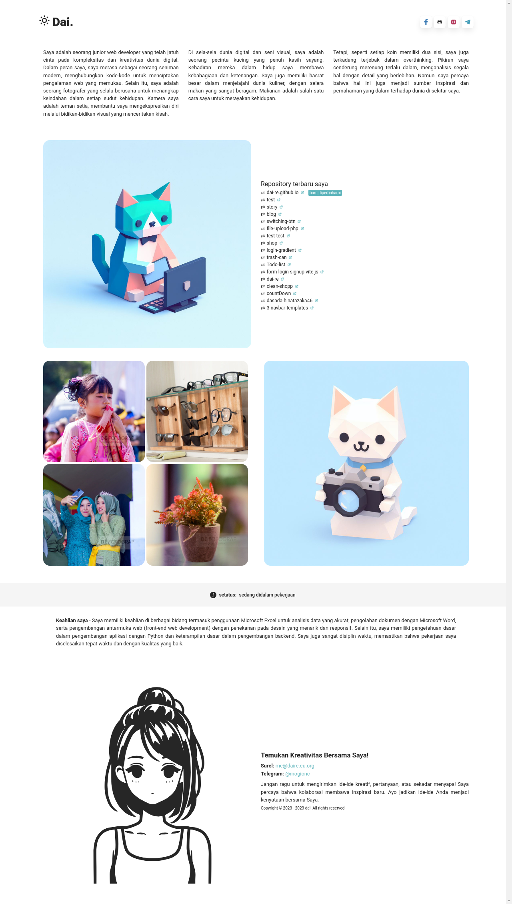

# React + Vite

- [x] [bulma](https://bulma.io/): ^0.9.4
- [x] [framer-motion](https://www.framer.com/motion/): ^10.16.4
- [x] [react](https://reactjs.org/): ^18.2.0
- [x] [react-dom](https://reactjs.org/docs/react-dom.html): ^18.2.0
- [x] [react-icons](https://react-icons.github.io/react-icons/): ^4.11.0
- [x] [sass](https://sass-lang.com/): ^1.69.4

## Fitur-fitur

- **Desain Responsif:** Website ini sepenuhnya responsif, memastikan pengalaman tanpa cacat di berbagai perangkat dan ukuran layar.

- **Elemen Interaktif:** Menggunakan animasi dan elemen interaktif .

- **Tampilan Proyek:** Menampilkan proyek-proyek terbaru dan paling signifikan saya dengan informasi terperinci dan tautan ke repositori proyek atau demo langsung.

- **Keterampilan & Teknologi:** Menyoroti keterampilan saya, bahasa pemrograman, dan teknologi yang saya kuasai.

## Teknologi yang Digunakan

- HTML5
- CSS3 (Sass untuk styling)
- JavaScript (Framework React)
- Framer Motion untuk animasi

## Memulai

1. Clone repositori ini: `git clone https://github.com/dai-re/dai-re.github.io.git`

2. Masuk ke direktori proyek: `cd dai-re.github.io`

3. Ketik perintah `pnpm i` lalu `pnpm run dev`.

## Pratinjau

## Kontribusi

Kontribusi sangat disambut! Jika Anda menemukan bug atau memiliki saran untuk perbaikan, jangan ragu untuk membuat isu atau mengirimkan permintaan pull.

## Lisensi

Proyek ini dilisensikan di bawah Lisensi MIT - lihat berkas [LICENSE](LICENSE) untuk detailnya.

---

_Selamat berkoding! 🚀_

[daire.eu.org](https://daire.eu.org/)

This template provides a minimal setup to get React working in Vite with HMR and some ESLint rules.

Currently, two official plugins are available:

- [@vitejs/plugin-react](https://github.com/vitejs/vite-plugin-react/blob/main/packages/plugin-react/README.md) uses [Babel](https://babeljs.io/) for Fast Refresh
- [@vitejs/plugin-react-swc](https://github.com/vitejs/vite-plugin-react-swc) uses [SWC](https://swc.rs/) for Fast Refresh
